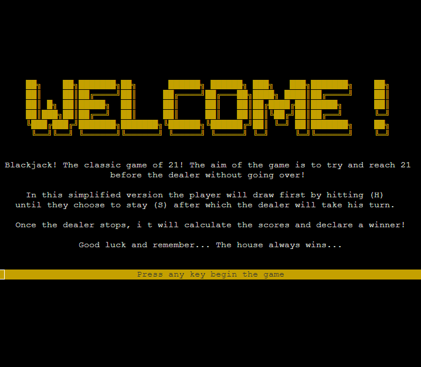

# Terminal Blackjack

Terminal based blackjack game created for PP3 of the diploma in fullstack software development.


Visit the deployed site: [Terminal Blackjack](https://terminal-blackjack-d1281da886b8.herokuapp.com)

## CONTENTS

- [Terminal Blackjack](#terminal-blackjack)
  - [The History Of Blackjack](#the-history-of-blackjack)
  - [Terminal Blackjack Overview](#terminal-blackjack-overview)
  - [How It Works](#how-it-works)
  - [User Stories](#user-stories)
  - [Features](#features)
    - [Future Features](#future-features)
  - [Data Model](#data-model)
  - [Development](#development)
    - [Languages](#languages)
    - [Tools](#tools)
  - [Testing](#testing)
  - [Deployment](#deployment)
  - [Credits & Attributions](#credits---attributions)
    - [Attribution](#attributions-)
    - [Other](#other)

---

### The history of blackjack

Equally well known as Twenty-One. Blackjack is a card game where players face off to create a hand of 21 on each round all while trying not to go over the number. While the popularity of Blackjack dates from World War I, its roots go back to the 1760s in France, where it is called Vingt-et-Un (French for 21). Today, Blackjack is the one card game that can be found in every casino.

### Terminal Blackjack Overview

Terminal blackjack is a game of blackjack that is well running on the users terminal. The game leverages the blessed library to create, paint to and refresh objects on the terminal
allowing the terminal to act like a basic GUI.

The game has a number of features

- A well mapped out data model with a flexible modular class to store state and attributes
- Usage of the `blessed` Python library for manipulation and control of the terminal
- A clean UX that provides an overlay of the current game progression and provides solid user feedback on the outcome of their choices.

---

### How It Works

Terminal blackjack works in the following way:

- Firstly: Initialize the game object (class)
- Seconly: Draw our terminal Output
- Third: Run the game until a victor is declared:
  - Player Step:
    - Presents the player with their choices
    - Allows the player to act on their choice
    - Update the game to give player feedback on their choice
  - CPU Step:
    - Passes the turn to the CPU
    - CPU makes their move
    - Update the board with the CPU's move
  - Check Game State:
    - Check to see if any of the victory / loss conditions are met
    - Repeat player and CPU steps
- Finally: Print Victory Message

The game runs utilizing a simplified version of the rules and concepts of blackjack so as to make the game a bit easier to code:

- The players attempt to beat the CPU by getting a count as close to 21 as possible, without going over 21.
- Players can opt to hit or stand, hit will deal them another card, stand will prevent them from drawing new cards until the next round.
- For simplicities sake the CPU will always try and draw until it is at 17 or over and then will automatically stand
- The closest player to 21 OR whoever lands on 21 wins, also for simplicities sake if both the player and CPU hit 21, the CPU (house) will be declared the winner

---

### User Stories

I opted to follow a traditional user stories / objective model on how to run the game.

As a user

- I want a dynamic game of blackjack that I can play, I don't want to have to scroll through hundreds of print statements
- I want the game to be simple to understand and play with clear instructions
- I want clear visual cues indicating the current state of the game

As the owner:

- I want to ensure a simple clean terminal that doesn't require a lot of print() statements
- I want to ensure that the site is visually striking and memorable
- My concern is less the site being responsive and more than it can be played on the devices, as it will be hosted in the terminal it won't be playable on mobile
- I want to ensure that the code leverages best practices as I want to extend this application in the future

---

### Features

The key features of the application are outlined below:

- Dynamic Terminal Output

  - For the game, the [blessed](https://github.com/jquast/blessed) Python library was used to updte the terminal dynamically, allowing for great user experience
  - To facilitate the repeated print statements, we utilized terminal commands in place, allowing us to dynamically print multiline strings
    using `term` commands
  - The following `gif` provides an example of this dynamic updating:
      <details>
      <summary><strong style="color:yellow">Dynamic game demo:</strong></summary>
      
      </details>

- Data Validation

  - As the game is primarily a terminal game we needed good data validation to ensure no game breaking occured
  - In order to do this we dedicated a check_validation function solely for this:

    - The function will check for the exact input we want and then return True if conditions met.

      ```py
      def validate_input(choice, op1, op2):
        if len(choice) != 1 or (choice.upper() != op1 and choice.upper() != op2):
        # return false so that loop does not return the correct choice
          return False
        # well if the input is valid, it must be what we want
        else:
          return True
      ```

      This logic while simple means that the user must give us 1 character and that character must match the
      two options we put in.

      An example of this is when we want to validate if the player hits or stands

      ```py
      validated_input = validate_input(user_choice, "H", "S")
      ```

      this also means the user can type "h" or "s" and it still is valid

- User Friendly Interface

  - When designing the game care was taken to ensure that the game was designed to be as clear and informative as posttible with extra care going into makeing sure the user was given clear feedback on their choices
    - Instructions are provided at the start of the game:
        <details>
        <summary><strong style="color:lightgreen">Instructions:</strong></summary>
        
        </details>
    - Input validation messages are displayed for invalid moves:
        <details>
        <summary><strong style="color:lightgreen">Input Validation:</strong></summary>
        
        </details>
    - During the game, the main screen keeps track of how many cards a user has and their score, same with the dealer
      <details>
      <summary><strong style="color:lightgreen">Status Dashbaord:</strong></summary>
      
      </details>
    - Depending on whether the user wins or loses they are presented with either a win or a loss screen
      <details>
      <summary><strong style="color:lightgreen">Victory / Defeat Messages:</strong></summary>
      
      
      </details>

### Future Features

Having now developed the game, there are additional features I can definitely see myself adding to the codebase in updates

- Id definitely like to tweak the cpu behaviour to try and play more dynamically, calculating odds for one, instead of just drawing to
  17 id like to try and build it out to think about best practices of when to hit and when to stand

- Id like to also rebuild the game to utilize more rules of the blackjack game as well as hidden dealer cards more akin to the original
  blackjack ruleset

- I also want to build out scoring systems and the ability to reshuffle the deck when it runs out of cards.

---

### Data Model

The data model for our game is built on the following files:

- terminal_paint.py
- card.py
- layout.py
- game.py
- run.py

By using these files we can create a slightly more modular game that utilizes good abstraction and more granular functions, as it stands I only created the Card
class for organizing and creating cards but id like to build a few more classes out in future updates as I feel the game can be truly component based and modular.

The following flowchart provides a high level overview of how the application works:

  <details>
  <summary><strong style="color:lightgreen">Flowchart / Data Model:</strong></summary>
  
  </details>

---

## Development

In developing this application, the following programming languages, tools and libraries were used:

### Languages

- Python
- HTML
- CSS
- JavaScript
- jQuery

### Tools

- **[VScode](https://code.visualstudio.com/)**  
  All coding was created in vs code desktop deployed through a gitpod library
- **[Heroku](http://heroku.com/)**  
  Heroku was used for the deployment of the app as github pages does not support backend mock terminals
- **[node-pty](https://github.com/microsoft/node-pty) and [xterm.js](https://github.com/xtermjs/xterm.js)**  
  These were used to hos the mock terminal, and were integrated as part of the CI python essentials template
- **[blessed](https://github.com/jquast/blessed)**  
  This Python library was used to dynamically update the Terminal window.

---

### Testing

Extensive testing of features was undertaken at every step of development, to ensure that the program worked effectively
while some small bugs were found the program executes and plays without any gamebreaking issues. 

Details on the testing can be found in the [Testing Document](https://github.com/ShaAnder/terminal_blackjack/main/TESTING.md) here.

---

### Deployment

The site is deployed using GitHub Pages - [Terminal Blackjack](https://terminal-blackjack-d1281da886b8.herokuapp.com).

#### How to Fork

To fork the repository:

1. Log in (or sign up) to Github.
2. Go to the repository for this project, [shaAnder/Quizzical](https://github.com/shaAnder/Quizzical)
3. Click the Fork button in the top right corner.

#### How to Clone

To clone the repository:

1. Log in (or sign up) to GitHub.
2. Go to the repository for this project, [shaAnder/Quizzical](https://github.com/shaAnder/Quizzical)
3. Click on the code button, select whether you would like to clone with HTTPS, SSH or GitHub CLI and copy the link shown.
4. Open the terminal in your code editor and change the current working directory to the location you want to use for the cloned directory.
5. Type 'git clone' into the terminal and then paste the link you copied in step 3. Press enter.

#### How to Deploy to heroku

1. Create a new heroku app
2. In config vars use PORT = 8000
3. Link the application to the repository
4. Hit Deploy

---

### Credits & Attributions

- **[blessed Python library](https://github.com/jquast/blessed)**
  Example applications and the docs really helped this come together
- **[xterm.js documentation](https://github.com/xtermjs/xterm.js/tree/4.14.1)**
  I used this as reference to figure out how to modify terminal size
- **[eoinlarkin](https://github.com/eoinlarkin)**
  It was eoins own p3 project that put me onto blessed. To figure out how to make a terminal game
  I poured through a lot of python pp3 projects to see how others did it and it was here I learnt
  of the existence of blessed
