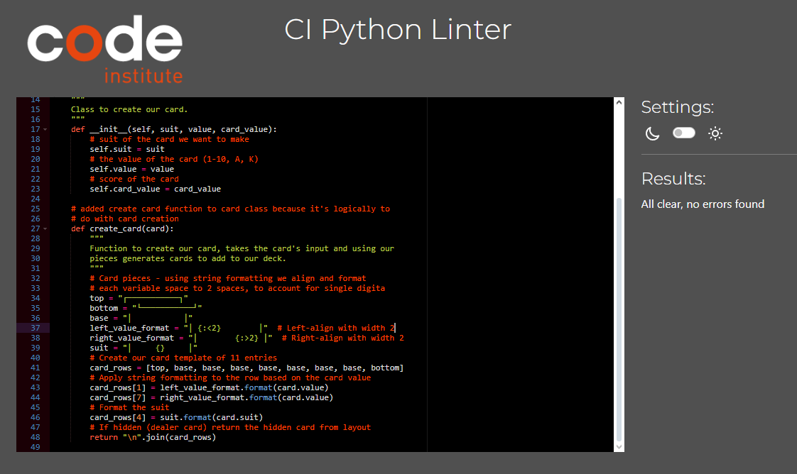
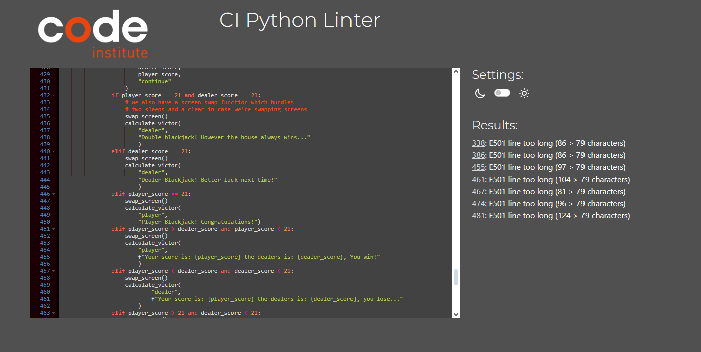
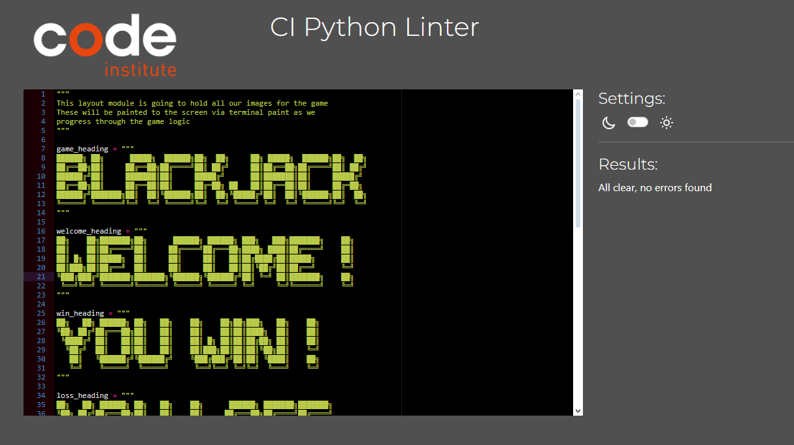
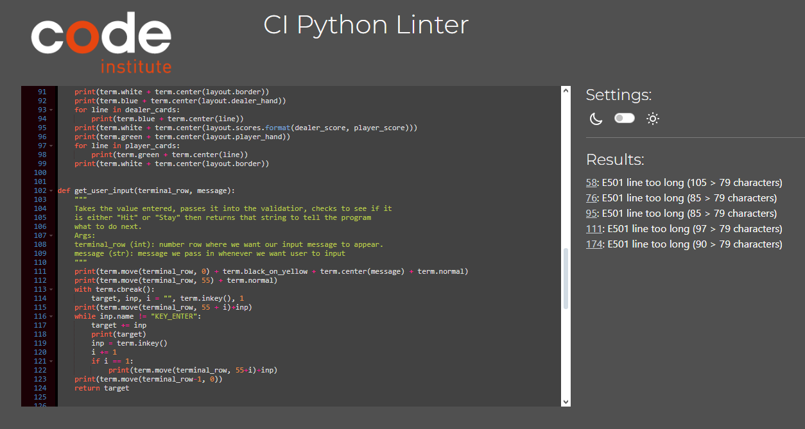

# Testing

Once the site was deployed there was extensive bug testing completed to ensure best functionality

The deployed project live link is [Terminal Blackjack](https://terminal-blackjack-d1281da886b8.herokuapp.com)

During the time testing I asked friends and family to test and thoroughly ensure the app worked. As it stands there are a few unsolved bugs
theres are documented below

The following tests were carried out to ensure that the game ran as expected

| **Feature**              | **Action**                                                                | **Expected Result**                         | **Actual Result** |
| ------------------------ | ------------------------------------------------------------------------- | ------------------------------------------- | ----------------- |
| Game boot                | Game begins upon run start button                                         | Intro screens displayed as expected         | Works as expected |
| User input functionality | Users are able to press any key to go through screens or control the game | User can play the game without issue        | Works as expected |
| Validation               | User cannot enter anything except what's expected, doing so throws err    | Error message appears                       | Works as expected |
| Gameplay                 | Gameplay loop works as intended                                           | Game play can be completed                  | Works as expected |
| WIn / Loss conditions    | When game is played are correct screens displayed                         | Correct win / loss screen shows             | Works as expected |
| Gameplay visuals         | Game displays cards and increments score                                  | Correct score incrementing and card visuals | Works as expected |

## Testing Browsers

The game was tested on a variety of browsers:

- Chrome
- Edge
- Firefox
- Oprea
- Safari

It worked without issues in the above browsers.

## BUG Fixing

Throughout the course of the project I documented and squashed most of the known bugs, these are found in the git commit message logs
under the "bug: " or "fix: " messages

### Known Bugs

While most bugs were caught during the testing of the project there were a few that I was unabele to fix in time or are known:

- The first bug occurs during the end of the game, while the game is fully playable, it was reported that sometimes instead of restarting
  the game, it would recalculate the victory / loss screen before restarting. During my testing I only encountered this once.

- The second known bug comes from when the user plays too many rounds, eventually the game will present a cannot draw from empty
  sequence bug. This is due to the deck object being out of cards to draw. This was intentional as a planned feature is going to be to
  offer the user to reshuffle the deck. In the interim period this bug is solved by removing the `deck.remove(card)` from the draw
  card function
  
- The final bug is in the form of the win / loss screens, after passing them through the validator and applying the changes they sometimes
  print improperly. Looking into a fix asap.

## PEP8 Python Validation

I ran all pages through the CI pep 8 validator and outside of a few of the string arguments going over 80 characters, found no
errors in the formatting or layout of the code

<strong style="color:yellow">Card Validation:</strong>

<strong style="color:yellow">Game Validation:</strong>

<strong style="color:yellow">Layout Validation:</strong>

<strong style="color:yellow">Terminal Paint Validation:</strong>

 

Also while the code is perfectly valid, I feel that the formatting could be better and as such one of the major
updates id like to do is to reformat it to be fully object oriented once the grading is complete

### [BACK TO README](https://github.com/shaAnder/terminal_blackjack/blob/main/README.md)
